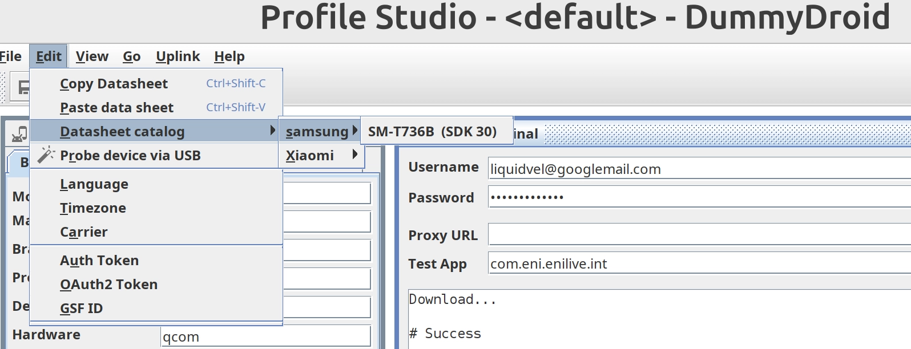
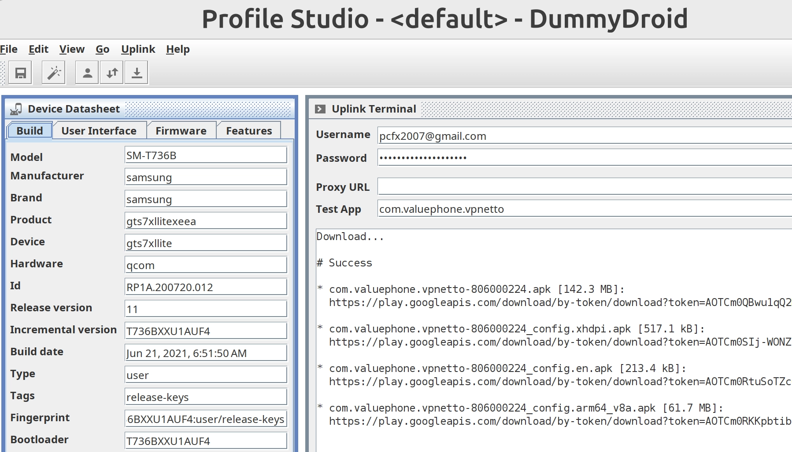

#+TITLE: android
#+DATE: 2026-04-24
#+AUTHOR: Michael Plankl

* Setup

** How to make application debuggable?

1. Download APK from apkpure.com
2. Unzip the =.xapk= file: =7z x foo.xapk=
3. Open the main APK in APKLab and patch HTTPS. Then rebuild it.
4. Open all other APKs in APKLab and just rebuild them.
5. Run the Android Emulator so the phone is visible via =adb devices=
6. Install all APKs with =adb install-multiple -r com.foo.bar.apk config.arm64_v8a.apk config.en.apk config.mdpi.apk=

Build dependencies for APKLab
#+begin_src bash
sudo apt install zipalign binfmt-support qemu-user-static temurin-22-jdk python3-pip
#+end_src

** Configure Burp

1. [[https://portswigger.net/burp/documentation/desktop/mobile/config-android-device][Install Burp certificate on Android]]
2. Set the proxy in the AVD settings to =10.211.55.2:8080=

** How to download APK directly from Google Play?

- Use DummyDroid and do [[https://raccoon.onyxbits.de/blog/needs-browser-login-workaround/][this]] [this]() tutorial
- Go to Edit > Datasheet catalog > samsung

- Go to Uplink > Register GFS ID
- Paste the id of the app into =Test App= field
- Go to Uplink > Download App

A

#+begin_example
* foo-806000224.apk [142.3 MB]:
  https://play.googleapis.com/download/by-token/download?token=...

* foo-806000224_config.xhdpi.apk [517.1 kB]:
  https://play.googleapis.com/download/by-token/download?token=...

* foo-806000224_config.en.apk [213.4 kB]:
  https://play.googleapis.com/download/by-token/download?token=...

* foo-806000224_config.arm64_v8a.apk [61.7 MB]:
  https://play.googleapis.com/download/by-token/download?token=...
#+end_example

* General

** Unpack APK

#+begin_src bash
    # d stands for decode
    # -f stands for --force, delete demoapp folder first if exists
    apktool d -f demoapp.apk
#+end_src

There are several folders and files:

| Resource              | Description                                                                                      |
|-----------------------+--------------------------------------------------------------------------------------------------|
| =AndroidManifest.xml= | Decompiled manifest file, describing its components, permissions, and features.                  |
| =apktool.yml=         | Configuration file used by Apktool for rebuilding the app.                                       |
| =lib=                 | Native libraries for different processor architectures.                                          |
| =original=            | Holds the original manifest and signature files as a reference.                                  |
| =res=                 | All application's resources like layouts and strings in an editable format.                      |
| =smali=               | Decompiled, human-readable byte code of the app from classes.dex that runs on Android Dalvik VM. |

** Decompile APK

Will give you the decompiled Java code.

#+begin_src bash
    # -r means don't decompile resources
    # -d is for destination
    jadx -r demoapp.apk -d jadx-demoapp

    /home/michael/.apklab/jadx-1.4.7/bin/jadx --deobf --show-bad-code -r -q -ds ./java_source demo.apk
#+end_src

** Repack APK

Repacking an APK requires three steps: reassemble, align and sign.

#+begin_src bash
    # repack.sh

    # remove old app
    adb uninstall com.cymetrics.demo

    # remove old apk
    rm -f demoapp2.apk
    rm -f demoapp2-final.apk
    rm -f demoapp2-aligned.apk

    # build
    apktool b --use-aapt2 demoapp -o demoapp2.apk

    # align
    zipalign -v -p 4 demoapp2.apk demoapp2-aligned.apk

    # sign
    apksigner sign --ks my-release-key.jks --ks-pass pass:123456 --out demoapp2-final.apk demoapp2-aligned.apk
    adb install demoapp2-final.apk
#+end_src

** View log of specific package name

#+begin_src bash
  adb logcat --pid=`adb shell pidof -s com.cymetrics.demo`
#+end_src

* AVD

** How to root Android Virtual Device (AVD)

1. Start AVD: =~/Library/Android/sdk/emulator/emulator @Medium_Phone_API_36.0=
2. Choose AVD image: =./rootAVD.sh ListAllAVDs=
3. e.g. =./rootAVD.sh system-images/android-36/google_apis_playstore/arm64-v8a/ramdisk.img=
4. Wait until AVD reboots
5. Start Magisk and reboot
6. Start Magisk > Settings > enable Zygisk and restart
7. =adb shell= and =su= then confirm message on AVD.

** How to fix grey screen after AVD boot**

Press =...= in AVD manager and click /Cold Boot/.

** How to change read-only build.prop items?

1. Root AVD using rootAVD
2. Install [[https://github.com/Magisk-Modules-Repo/MagiskHidePropsConf][MagiskHidePropsConf]] using Magisk
3. Run =adb shell= > =su= > =props= > Select =1= (Edit device fingerprint) and pick a one
4. Select > =3= (Device simulation) > =s= (Device simulation) > =y= > e.g. =1,5,6=
   
