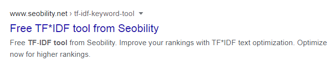

#+TITLE: seo
#+DATE: 2026-04-06
#+AUTHOR: Michael Plankl
#+IMAGE_SAVE_DIR: content/cheatsheets/seo/images/

* Glossar

| Term                | Description                                   |
|---------------------+-----------------------------------------------|
| Container           | Represents ~Website in GTM                    |
| GA                  | Google Analytics                              |
| GBP                 | Google Business Profile                       |
| GTM                 | Google Tag Manager                            |
| Local Pack / 3-Pack | 3 highlighted listings of local businesses    |
| SEO                 | Search Engine Optimization                    |
| SERP                | Search Engine Result Page                     |
| Tag                 | Tracking code that can be activated on a page |

* Basics: SEO
** What makes good SEO?
- *EEAT* Google's framework to evaluate high-quality, people-first content.
    - *E*xperience: the content shows first-hand or life experience with the topic.
    - *E*xpertise: the creator has relevant knowledge or skill.
	- /Was this written by someone who actually knows the topic?/
    - *A*uthoritativeness: the creator or site is recognized as a credible source in that area.
    - *T*rustworthiness: the content and site are accurate, honest, safe, and dependable. Google’s guidance treats trust as especially important.
	- /Does this show real-world experience?/

** SERP
/Search Engine Result Page/

*** Structure
- Google's search results are called /snippets/
- SERP shared among paid ads, search features and organic results
- Max. 10 organic results per page
  
#+CAPTION: SERP Structure
#+NAME: fig:serp
#+ATTR_HTML: :width 900px

*** SERP Snippet
A SERP snippet consists of
- [[https://www.seobility.net/en/wiki/Meta_Title][Meta title]] from ~<title>~
- [[https://www.seobility.net/en/blog/meta-descriptions/][Meta description]] from ~<meta name="...">~
- [[https://www.seobility.net/en/wiki/URL][URL]]

#+CAPTION: SERP snippet
#+NAME: fig:snippet
#+ATTR_HTML: :width 900px

*** SERP Snippet Generator
Optimize your SERP snippet: [[https://www.seobility.net/en/serp-snippet-generator/][SERP Snippet Generator]]
